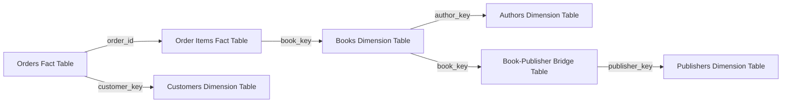

```mermaid
graph LR;
    orders_fact[Orders Fact Table] -- order_id --> order_items_fact[Order Items Fact Table];
    order_items_fact -- book_key --> books_dim[Books Dimension Table];
    books_dim -- author_key --> authors_dim[Authors Dimension Table];
    books_dim -- book_key --> book_publisher_bridge[Book-Publisher Bridge Table];
    book_publisher_bridge -- publisher_key --> publishers_dim[Publishers Dimension Table];
    orders_fact -- customer_key --> customers_dim[Customers Dimension Table];

```

